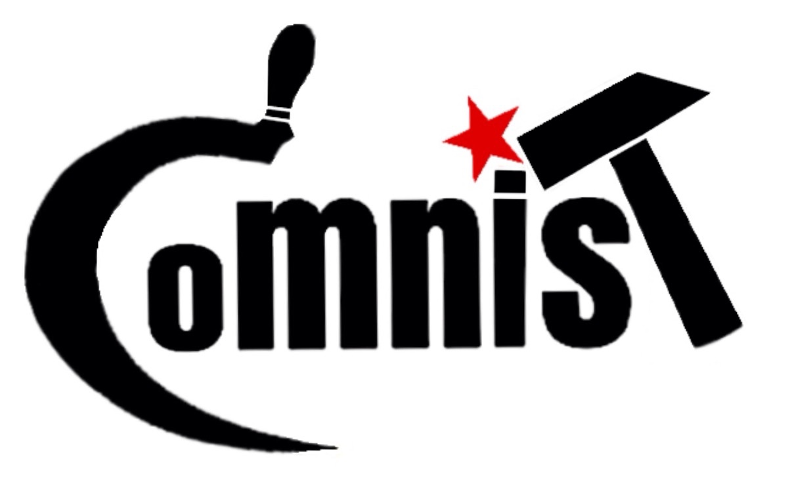

## Cyrillic-oriented MNIST

### CoMNIST services
<b>A repository of images of hand-written Cyrillic and Latin alphabet letters for machine learning applications.</b>

The repository currently consists of 28,000+ 278x278 png images representing all 33 letters of the [Russian alphabet](images/Cyrillic.zip) and the 26 letters of the [English alphabet](images/Latin.zip).
These images have been hand-written on touch screen through crowd-sourcing.

<b> An API that reads words in images</b>

CoMNIST also makes available a web service that reads drawing and identifies the word/letter you have drawn.
On top of an image you can submit an expected word and get back the original image with mismtaches highlighted (for educational purposes)

The API's code is available in this github repo.
Once the service is started you can access it via a POST request with following input expected:
```
{
    'img': Mandatory b64 encoded image, with letters in black on a white background
    'word': Optional string, the expected word to be read
    'lang': Mandatory string, either 'en' or 'ru', respectively for Latin or Cyrillic (russian) alphabets
    'nb_output': Mandatory integer, the "tolerance" of the engine
}
```

The return information is the following:
```
{
    'img': b64 encoded image, if a word was supplied as an input, then modified version of that image highlighting mismatches
    'word': string, the word that was read by the API
}
```

### Participate
The objective is to gather at least 1000 images of each class, therefore your contribution is more that welcome! One minute of your time is enough, and don't hesitate to ask your friends and family to participate as well.

[English version](http://comnist.gregvi.al) - Draw Latin only + common to cyrillic and latin

[French version](http://comnist.gregvi.al/?fr) - Draw Latin only + common to cyrillic and latin

[Russian version](http://comnist.gregvi.al/?ru) - Draw Cyrillic only

Find out more about CoMNIST on my [blog](http://ds.gregvi.al/2017/02/28/CoMNIST/)

### Credits and license

A big thanks to all the [contributors](misc/contributors.md)!

These images have been crowd-sourced thanks to the web page developed by Anna Migushina available on [github](https://github.com/migusta/coMNIST).

CoMNIST logo by Sophie Valenina
<a rel="license" href="http://creativecommons.org/licenses/by-sa/4.0/"></a><br /><span xmlns:dct="http://purl.org/dc/terms/" property="dct:title">CoMNIST</span> by <a xmlns:cc="http://creativecommons.org/ns#" href="https://github.com/GregVial/CoMNIST" property="cc:attributionName" rel="cc:attributionURL">Gregory Vial</a> is licensed under a <a rel="license" href="http://creativecommons.org/licenses/by-sa/4.0/">Creative Commons Attribution-ShareAlike 4.0 International License</a>.
